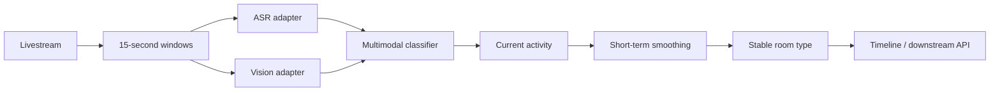

# Livestream Scene Recognition Demo

[](https://github.com/chenshuyu1216/chenshuyu1216-livestream-scene-recognition-demo/actions/workflows/tests.yml)
[](https://www.python.org/downloads/)
[](LICENSE)

A privacy-safe portfolio implementation of a real-time multimodal livestream scene classification workflow.

The project classifies 15-second livestream windows into four categories:

- `ecommerce`
- `gaming`
- `entertainment`
- `chatting`

It combines precomputed speech and visual descriptions, produces a direct activity prediction for every window, and applies two levels of temporal aggregation to reduce room-level label jitter.

> This repository is an independently rewritten public demo. It contains no employer source code, production API contract, credentials, private livestream URLs, model weights, or real user/streamer data.

## Why this project matters

Livestream scenes are difficult to classify from a single frame. A singer may pause to talk, an e-commerce host may temporarily stop mentioning products, and a game stream may include face-camera segments. This demo illustrates a practical approach:

1. Divide a stream into 15-second windows.
2. Combine ASR text and visual descriptions.
3. Predict the current activity.
4. Smooth recent predictions.
5. Update the long-term room type only after repeated evidence.



## Quick start

Python 3.10+ is sufficient; the public demo has no third-party runtime dependencies.

```bash
python -m livestream_scene_demo.cli \
  --input data/sample_windows.jsonl \
  --output outputs/demo_predictions.jsonl
```

Run the tests:

```bash
python -m unittest discover -s tests -v
```

Evaluate the synthetic example:

```bash
python scripts/evaluate_demo.py data/sample_windows.jsonl
```

Expected evaluation summary:

```json
{
  "correct": 12,
  "total": 12,
  "accuracy": 1.0
}
```

This score only verifies that the transparent demo rules behave as expected on
the included synthetic examples. It is not presented as a learned-model or
real-world accuracy result.

## Repository structure

```text
livestream_scene_demo/  Core public implementation
data/                   Synthetic input only
scripts/                Reproducible evaluation command
tests/                  Unit tests
docs/                   Architecture, methodology and result notes
outputs/                 Generated locally and ignored by Git
```

## Input format

Each JSONL line represents one time window:

```json
{
  "room_id": "synthetic_singer_01",
  "window_start": "2026-01-01T12:00:00Z",
  "asr_text": "<|BGM|> ...lyrics...",
  "visual_description": "A host is singing into a microphone",
  "label": "entertainment"
}
```

The included classifier is deliberately transparent and deterministic. In a real deployment, replace `KeywordMultimodalClassifier` with an adapter backed by a trained semantic classifier while keeping the event and temporal interfaces unchanged.

## Origin and reported internship results

This public demo was derived from lessons learned during a one-month AI R&D internship. In the private project:

- 790 valid 15-second clips from 67 livestream rooms were collected and reviewed.
- A V5 candidate was trained with 501 windows from 42 rooms.
- On five newly collected rooms used for exploratory comparison, V5 produced 52/60 correct window predictions versus 44/60 for V4.
- A newly collected singing room improved from 4/12 to 12/12 correct windows.
- A Linux GPU worker processed a 15-second window in approximately 1.5–2.1 seconds under the tested single-room configuration.

These are small-sample project results, not claims of general production accuracy. Raw data and the private implementation are not included.

### Public demo versus private internship system

| Area | Public repository | Private internship project |
| --- | --- | --- |
| Input | Synthetic ASR and vision text | Real, permission-controlled livestream windows |
| Classifier | Transparent deterministic rules | Learned semantic classifier with multimodal features |
| Temporal logic | Included | Used in the real-time pipeline |
| Media collection | Excluded | Separate controlled collection subsystem |
| Deployment | Architecture notes only | Linux GPU worker and database delivery |
| Purpose | Reproducible portfolio demonstration | Internal R&D prototype |

See [methodology](docs/methodology.md), [architecture](docs/architecture.md), and [reported results](docs/results.md) for details and limitations.

## Privacy and responsible use

Only synthetic data is included. Before applying the workflow to real streams, obtain appropriate permission, follow platform terms, minimize retention, and avoid publishing personal data or signed media URLs. See [privacy and publication policy](docs/privacy.md).

## License

The independently written demo code is released under the MIT License. Third-party models and datasets remain subject to their own licenses.
